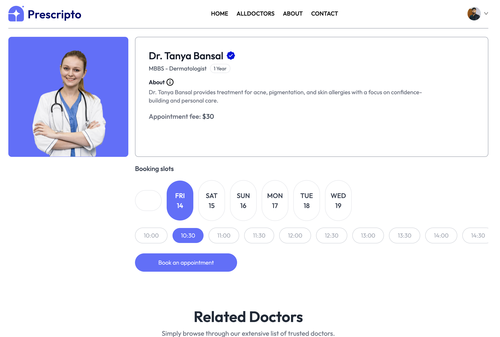
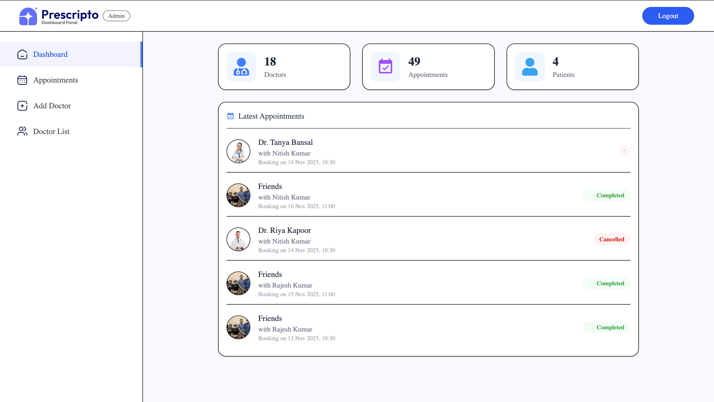
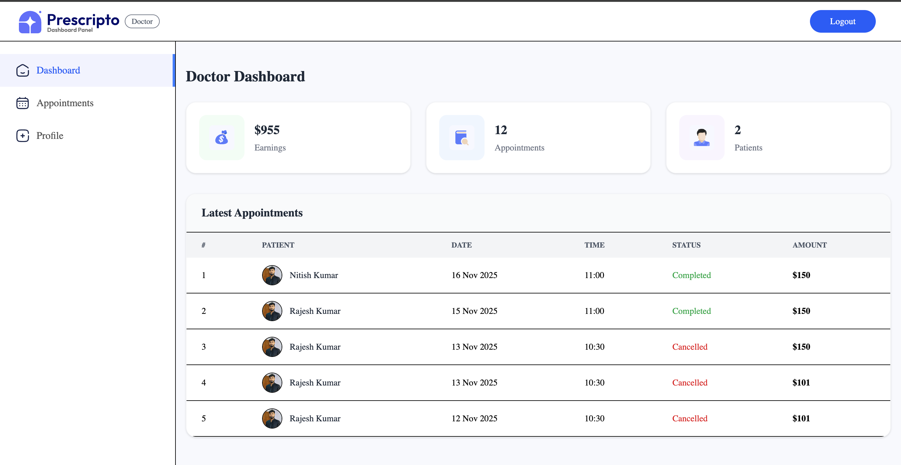

# Prescripto – Online Doctor Appointment Booking System

A full‑stack medical appointment booking platform built using the MERN stack, designed to demonstrate strong real‑world development skills for internships and job placements. This project includes a User App, Doctor Portal, and Admin Dashboard — showcasing end‑to‑end system design, authentication, payments, role‑based access, and production deployment.

---

## ⭐ Project Highlights (Why This Project Is Job‑Ready)
- Fully functional production-grade system (User + Admin + Doctor panels)
- Secure authentication using JWT
- Real online payments integrated using Razorpay
- Image/file uploads via Multer
- Role-based access control (Admin/Doctor/User)
- Modern UI built with React + Vite
- Optimized backend with Express & MongoDB
- Deployed on Vercel & Cloud hosting
- Clean folder structure + reusable components + organized controllers/routes

This project demonstrates my ability to build complete full‑stack applications that companies expect from MERN developers.

---

## 🚀 Tech Stack
### Frontend (User + Admin + Doctor)
- React.js (Vite)
- React Context API
- Axios
- Tailwind / CSS

### Backend
- Node.js / Express.js
- MongoDB & Mongoose
- JWT Authentication
- Multer (uploads)
- Razorpay Payment Gateway
- CORS

### Deployment
- Frontend → Vercel
- Backend → Render / Railway / Vercel Serverless
- Database → MongoDB Atlas

---

## 🏗️ Project Structure
```
prescripto /
├── backend /
│   ├── controllers /
│   ├── models /
│   ├── routes /
│   ├── middlewares /
│   ├── server.js
│   └── .env
├── frontend /
│   ├── src /
│   ├── public /
│   └── .env
├── admin /
│   ├── src /
│   ├── public /
│   └── .env
└── README.md
```

---

## ✨ Features
### 👤 User Features
- Register / Login
- Browse doctors
- Book appointment
- Online payment (Razorpay)
- Update profile
- Cancel appointments

### 🩺 Doctor Features
- Login
- View upcoming appointments
- Mark appointment as completed
- Manage availability

### 🛠️ Admin Features
- Login
- Approve / Reject doctors
- View all doctors
- Manage users
- Monitor all appointments

---

## 🔑 Environment Variables
### Backend `.env`
```
PORT=5000
MONGODB_URL=your_mongodb_url
JWT_SECRET=your_secret
RAZORPAY_KEY=your_razorpay_key
RAZORPAY_SECRET=your_razorpay_secret
CORS_ORIGIN=https://your-frontend-url.vercel.app
```
### Frontend/Admin `.env`
```
VITE_BACKEND_URL=https://your-backend-url.com
VITE_RAZORPAY_KEY_ID="your-key-id"
```

---


## ⚙️ Installation & Setup
### Clone the Repo
```bash
git clone https://github.com/your-username/prescripto-doctor-appointment-system.git
cd prescripto-doctor-appointment-system
```

### Install Dependencies
#### Backend
```bash
cd backend
npm install
```
#### Frontend
```bash
cd ../frontend
npm install
```
#### Admin
```bash
cd ../admin
npm install
```

---

## ▶️ Running the Project Locally
### Backend
```bash
cd backend
npm run dev
```
### Frontend
```bash
cd frontend
npm run dev
```
### Admin
```bash
cd admin
npm run dev
```

---

## 🌐 Deployment
### Frontend (User & Admin)
- Deploy on Vercel
- Add environment variables

### Backend
- Deploy on Render / Railway / Vercel Serverless
- Add `.env`
- Set correct CORS policy

---

## 🧾 API Endpoints Overview
### User Routes
```
POST   /api/user/register
POST   /api/user/login
GET    /api/user/profile
PUT    /api/user/update
POST   /api/user/book-appointment
POST   /api/user/payment
POST   /api/user/payment/verify
```

### Doctor Routes
```
POST   /api/doctor/login
GET    /api/doctor/appointments
PUT    /api/doctor/status
```

### Admin Routes
```
POST   /api/admin/login
GET    /api/admin/doctors
PUT    /api/admin/approve-doctor
```

---

## 📸 Screenshots
You can add:





---

## 🎯 Future Enhancements
- Email / SMS notifications
- Doctor calendar scheduling
- Chat between doctor & patient
- Admin analytics dashboard
- Multi-language support

---

## 👨‍💻 Developer
**Rajesh Kumar**
- MERN Stack Developer  
- LinkedIn: [https://www.linkedin.com/in/rajesh-kumar-791679297]


If you found this project useful, please ⭐ the repository!

